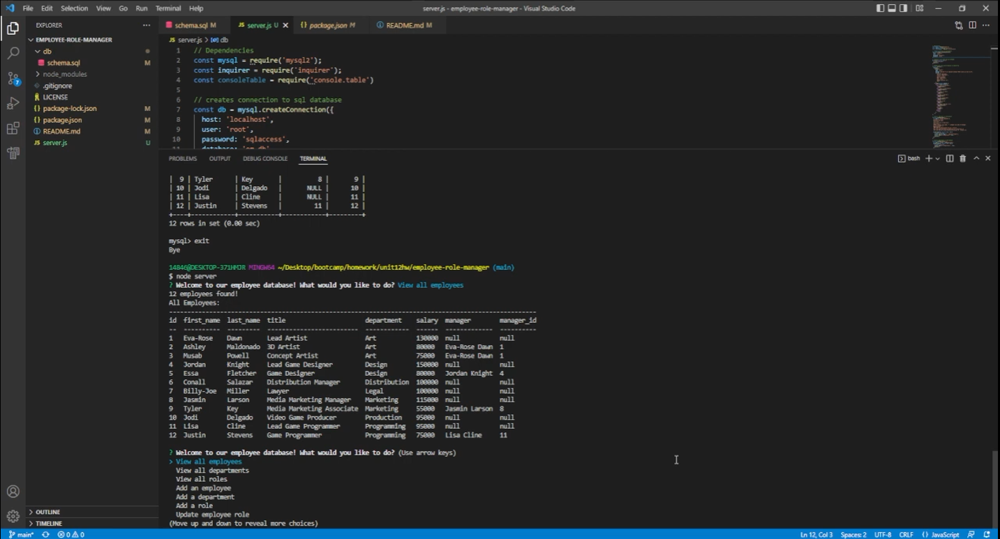

# Employee Manager

  

  #### Table of Contents
  
  1. [Description](#description)
  2. [Installation Instructions](#installation-instructions)
  3. [Usage Information](#usage-information)
  4. [Contributor Guidelines](#contributor-guidelines)
  5. [Test Instructions](#test-instructions)
  6. [License](#license)
  7. [Questions](#questions)
  
  ## Description
  * This program features backend code that enables the user to view, add, and update employees in a mySQL database.
  
  ## Installation Instructions
  * In order to install this program, you must have node.js installed first. Download this repository and access it in your terminal of choice. When you are in the root folder enter "npm install" in the terminal to install all necessary packages. Afterwards, type "node server" into the prompt to begin the program.

  * Watch the video on how to install this program and get it running [here](https://youtu.be/0t26D_Qnz3E)
  
  
  ## Usage
  * Use this program to manage your employees, their roles, and who their managers are. 
  
  ## Contributor Guidelines
  * Currently, no contributions necessary.
  
  ## Test Instructions
  * No testing required.
  
  ## License
  * The application is covered under the following license:
    [mit](https://choosealicense.com/licenses/mit)
  
  ## Questions
  * Follow me on GitHub for updates and future projects at (http://github.com/jakekeebler)
  
  * If you have any questions on this project, email me at (jakekeebler@gmail.com)